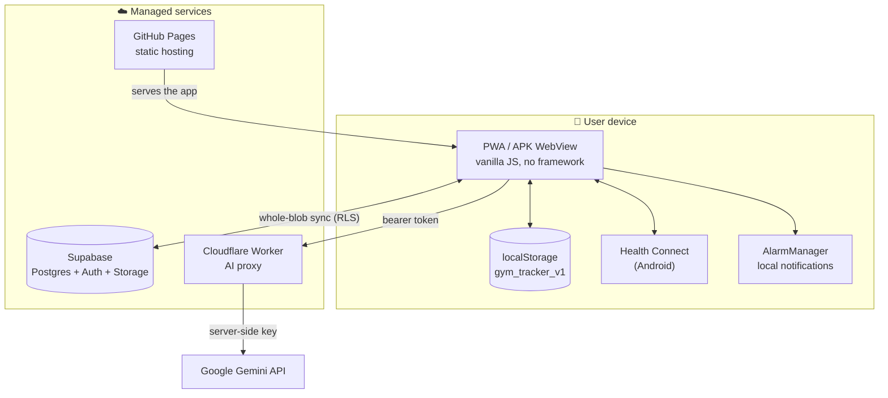
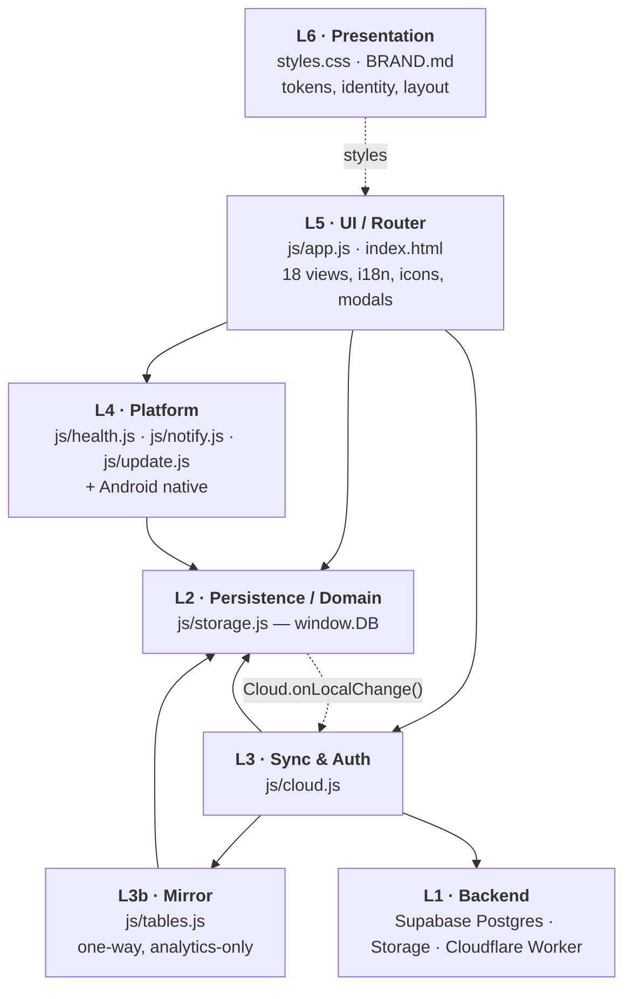
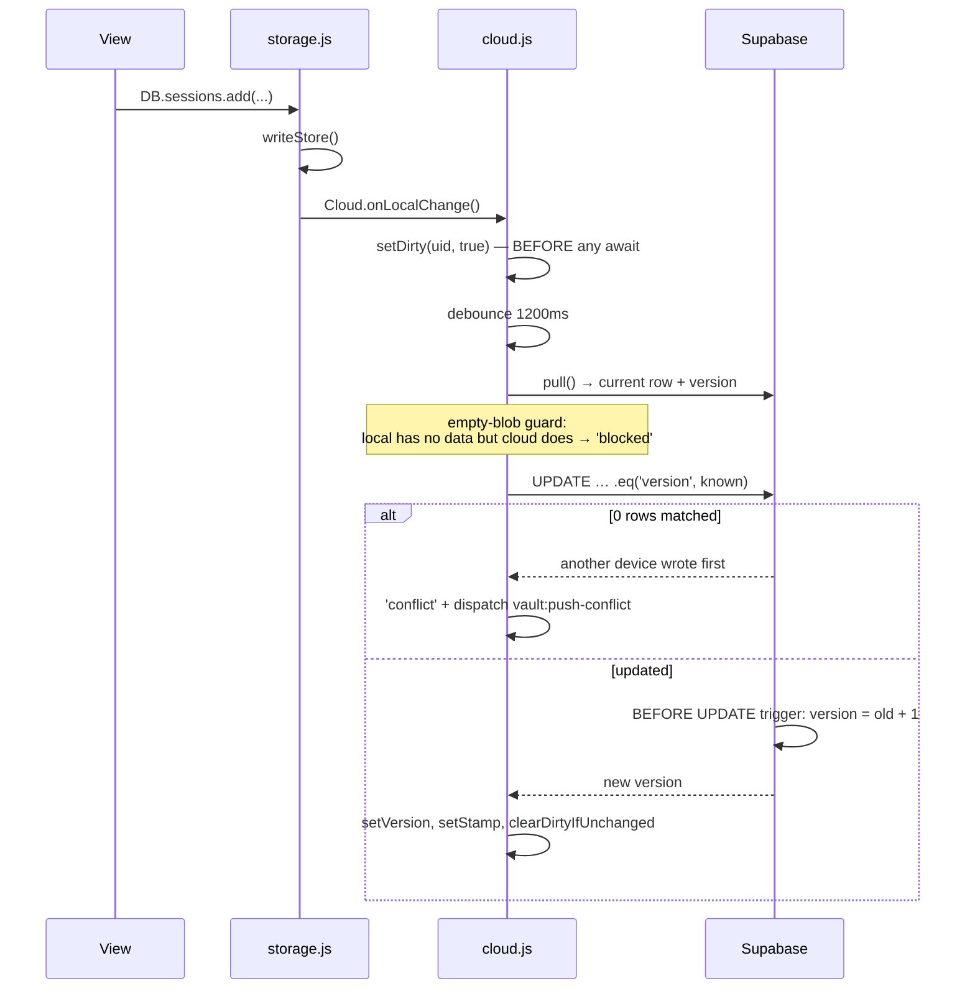
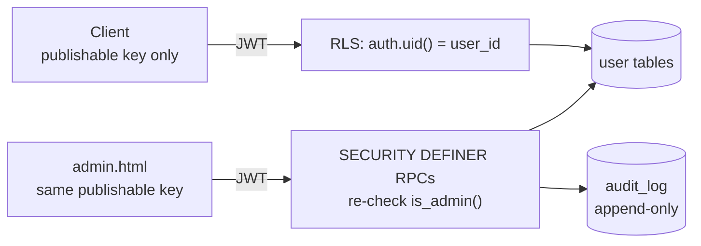

# THE VAULT — Low-Level Design

**Version of record:** web `v217` · APK `build 13 / v2.2`
**Status:** living document. Every claim below was read out of the source, not inferred.
**Audience:** anyone who has to change this system without breaking it.

---

## 0. How to read this document

Each layer section follows the same shape:

| Sub-section | What it holds |
|---|---|
| **Responsibility** | The one job. If a change does not serve this, it belongs in another layer. |
| **Files** | The real paths and what each owns. |
| **Data owned** | The exact shapes, with the real field names. |
| **Public surface** | What other layers may call. Anything not listed is private by convention. |
| **Control flows** | Step-by-step, each step naming a real function. |
| **Invariants** | Rules that MUST hold, each with its reason. Breaking one of these is how the system fails. |
| **Failure modes** | How the layer degrades, and what it does about it. |

Line references are `file:line` against the v217 tree. They rot; the identifiers do not. When they disagree, trust the identifier and re-find the line.

---

## 1. System context

THE VAULT is a **bilingual (EN/AR, full RTL) fitness and nutrition tracker**, built as a
local-first PWA and distributed on Android as a Capacitor shell.



### 1.1 Defining constraints

These are not incidental. Almost every design decision downstream follows from them.

| Constraint | Consequence |
|---|---|
| **No build step, no bundler, no framework** | Modules communicate through `window.*` globals. Script order in `index.html` *is* the dependency graph. |
| **No test framework** | Correctness is enforced by invariants written into comments, a pre-commit guard, and manual browser verification. |
| **Single-owner product** | The admin console runs on the user's own JWT + RLS; there is no separate back office and no service-role key anywhere. |
| **Local-first** | The device is the source of truth. The network is an optimisation, never a prerequisite. |
| **Live-URL native shell** | Web changes reach installed APKs without a reinstall. Only native resources require a new APK. |
| **One blob, synced whole** | Every byte added to `STATE` is uploaded on every save. Growth is actively fought. |

---

## 2. Layer stack



### 2.1 The dependency rule

**Everything reaches data through `window.DB`.** There is no second door except two
deliberate, documented exceptions (§3.6). A layer may call *down*; it signals *up* only
through `window` CustomEvents.

### 2.2 Module map — who defines what

`index.html` loads in this exact order, and the order is load-bearing:

```
js/cloud.js → js/storage.js → js/tables.js → js/app.js
            → js/health.js → js/notify.js → js/foodai.js → js/update.js
```

| Global | Defined in | Consumers (call sites) |
|---|---|---|
| `DB` | `js/storage.js` | app.js ×241, health.js ×20, notify.js ×10, cloud.js ×5, tables.js ×4, foodai.js ×3, update.js ×1 |
| `Cloud` | `js/cloud.js` | app.js ×62, tables.js ×7, foodai.js ×2, storage.js ×1 |
| `Notify` | `js/notify.js` | app.js ×18 |
| `FoodAI` | `js/foodai.js` | app.js ×8 |
| `Health` | `js/health.js` | app.js ×4 |
| `VaultUpdate` | `js/update.js` | app.js ×2 |
| `Tables` | `js/tables.js` | cloud.js ×2 |
| `todayISO`, `addDaysISO`, `formatDate`, `formatDateShort`, `formatDuration`, `formatTime12`, `inRangeISO`, `startOfWeek`, `daysAgo`, `uid`, `exerciseImageUrl`, `machineImageUrl`, `machineSvgFor`, `EXERCISE_CATEGORIES`, `CARDIO_TYPES`, `CARDIO_ICON_OPTIONS` | `js/storage.js` | app.js, notify.js, foodai.js |

> **Note the cycle.** `storage.js` calls `Cloud.onLocalChange()` and `cloud.js` calls `DB.reload()`.
> It is resolved by *lateness*: both calls happen at event time, never at load time, and both are
> guarded (`if (window.Cloud)`). This is why `cloud.js` may load before `storage.js`.

> **`window.VaultUpdate`, not `window.Update`.** A frequent mis-call.

---

## 3. L2 — Persistence / Domain State (`js/storage.js`, 1882 lines)

### 3.1 Responsibility

Own the entire domain model and the **only durable write path**. One `let STATE` in memory,
one localStorage key, one `writeStore()`. Parse-and-repair on boot; expose typed accessors;
guarantee a failed write is **loud**, never silent.

It also computes three things that are not storage, because every consumer must agree on them
and there is nowhere else common to all:

1. the continuous-rotation resolver (`workoutForDate`),
2. the reminder schedule (`DB.reminders.schedule`),
3. the nutrition calculator (`DB.nutrition.compute`, Mifflin-St Jeor).

### 3.2 The blob

`localStorage['gym_tracker_v1']` — one JSON object, key order per `defaultState()` (:357):

```js
{
  version: 1,          // written at :359, NEVER read. All migrations are shape-sniffing.
  prefs, exercises[], sessions[], cardio[], cardioTypes[], foods[], sleep[],
  plan, supplements[], reminders, supplementLogs{}, foodLogs{}, water{},
  bodyweight[], nutrition, health
}
```

> **⚠ Two unrelated fields are both called `version`. Do not conflate them.**
>
> | Field | Where | Read by anyone? |
> |---|---|---|
> | `STATE.version` | inside the blob, `= SCHEMA_VERSION = 1` | **Never.** Grep confirms it is written at `:359` and read nowhere. Every migration sniffs *shape*, not version. |
> | `vault_data.version` | the Postgres **row**, `cloud.js:243` | **Yes** — server-authoritative optimistic concurrency (§4). Incremented by a BEFORE UPDATE trigger; the client only reads and echoes it. |
>
> Bumping `SCHEMA_VERSION` would therefore change nothing at all.

`loadState()` also **deletes seven retired keys** on every load — `pinHash`, `pinSalt`, `pinSetAt`,
`autoLock`, `securityQuestion`, `securityAnswerHash`, `securityAnswerSalt` — left over from a
removed PIN/recovery feature. They are stripped rather than ignored because the blob is uploaded
whole and dead credential material should not keep travelling to the cloud.

### 3.3 Entities

| Entity | Shape | Notes |
|---|---|---|
| `prefs` | `{lang:'en'\|'ar', theme:'dark'\|'light', unit:'kg'\|'lb', translateExercises, onboarded?}` | `onboarded` is **not** in `defaultState` and is never backfilled — it springs into existence at `setOnboarded()` (:772). |
| `exercise` | `{id, name, category, imageSlug, machineType, customImage, imagePath, isCustom, inMyList, createdAt}` | `customImage` is base64 **in the blob**; `imagePath` points at the durable Supabase Storage copy. |
| `session` | `{id, exerciseId, date:'YYYY-MM-DD', sets:[{reps,weight}], createdAt}` | Every set coerced `Number(x) \|\| 0` (:1392) — NaN can never enter the store. Weight is kg-canonical. |
| `plan` | `{mode:'rotation', cycle:[{name, exerciseIds}], trainingDays:[0-6], anchor, restDates:[]}` | `cycle` **order is the rotation order**. `trainingDays` holds `getDay()` values, kept sorted. |
| `cardio` | `{id, type, date, duration, calories, createdAt, source?, hcKey?}` | `hcKey` = Health Connect session start; the dedupe key. |
| `foodLogs[date][]` | `{id, foodId, name, servings, calories, protein, carbs, fat, source, addedAt}` | Macros stored **per serving**; totals multiply by `servings` (:1034). Date key deleted when the day empties (:1027). |
| `sleep` | `{id, date, sleepTime, wakeTime, durationMinutes, createdAt, stages?, source?, hcKey?}` | `computeSleepMinutes()` adds 24h when wake ≤ sleep, so a cross-midnight night measures correctly. |
| `supplement` | `{id, name, dose, color, times:['HH:MM'], createdAt}` | `times` are **local wall-clock strings**, never timestamps. |
| `supplementLogs[date][id]` | `true` | Sparse presence map — `setTaken(…, false)` **deletes** the key (:966). |
| `water[date]` | `Number` (ml) | Clamped ≥ 0 on write (:1122), which is why the UI's undo is a negative add. |
| `bodyweight[]` | `{date, kg}` | One entry per day (upsert, :1102); rounded to 0.1; `≤ 0` rejected silently. |
| `reminders` | `{enabled, sound?, water:{on, from, to, everyMin}}` | `sound` is **synthesised** by `get()` as `r.sound !== false` (:1478) — an older blob defaults to sound ON. |
| `nutrition` | `{mode:'off'\|'calc'\|'manual', profile:{…}, targets:{…}}` | `mode:'off'` is what renders the Food setup prompt. |
| `health` | `{data, syncedAt, hidden:[]}` | Device-local cache of Health Connect output + per-metric visibility. |
| *(derived)* schedule item | `{id, kind:'supplement'\|'water', refId?, hour, minute, at, name?, dose?}` | Never stored. `id = hashId(…)`, a **stable** int. |
| *(quarantine)* | `localStorage['gym_tracker_v1__corrupt']` | The raw unparseable string, saved before READ-ONLY engages. |

### 3.4 Public surface — `window.DB`

**15 namespaces** plus 6 top-level methods and `DB.reload`.

| Namespace | Key methods |
|---|---|
| *(top level)* | `getAll()`, `exportJSON()`, `importJSON(json)`, `resetAll()`, `_validateBlob(d)`, `_idsSafe(d)`, `reload()` |
| `prefs` | `get`, `setLang`, `setTheme`, `setUnit`, `setTranslateExercises`, `onboarded`, `setOnboarded` |
| `plan` | `get`, **`workoutForDate(D)`**, `isRest`, `setRest`, `toggleRest`, `setRotation`, `setTrainingDays`, `addSlot`, `removeSlot`, `moveSlot`, `setSlotName`, `setSlotExercises`, `addExerciseToSlot`, `removeExerciseFromSlot`, `clearAll` |
| `exercises` | `list`, `getById`, `add`, `update`, `remove`, `setInMyList`, `mergeGlobal` |
| `sessions` | `listAll`, `listByExercise`, `lastForExercise`, `get`, `add`, `update`, `remove`, `bestStats`, `bestOneRM`, `prSnapshot` |
| `cardio` | `list`, `add`, `update`, `remove`, `importFromHealth` |
| `cardioTypes` | `list`, `allTypes`, `findById`, `add`, `remove` |
| `foods` | `list`, `add`, `update`, `remove` |
| `foodLogs` | `listForDate`, `add`, `update`, `remove`, `totalsForDate`, `frequent` |
| `sleep` | `list`, `latest`, `add`, `update`, `remove`, `importFromHealth` |
| `supplements` | `list`, `add`, `update`, `setTimes`, `remove`, `isTaken`, `setTaken`, `streak` |
| `water` | `get`, `goal`, `add` |
| `bodyweight` | `list`, `latest`, `log`, `remove` |
| `nutrition` | `get`, `hasTargets`, `compute`, `setProfile`, `setTargets`, `clear` |
| `reminders` | `get`, `setEnabled`, `setSound`, `setWater`, **`schedule()`** |
| `health` | `get`, `setData`, `isHidden`, `toggle` |

### 3.5 The rotation model

This is the most subtle piece of domain logic in the system.

```
workoutForDate(D):
  1. no plan / mode≠rotation / empty cycle        → null
  2. D.getDay() ∉ trainingDays                    → null   (scheduled rest weekday)
  3. isoOf(D) ∈ restDates                         → null   (user declined this day)
  4. D < anchor                                   → null   (before the plan started)
  5. elapsed = trainingDaysBetween(anchor, D, td, rest)
  6. return cycle[((elapsed % len) + len) % len]           (double modulo: sign-safe)
```

`trainingDaysBetween` (:441) counts training weekdays in `[anchor, D)` **skipping `restDates`**.
That single skip is the entire *postpone* behaviour:

> A day that does not count as elapsed does not advance the cycle. The workout it would have
> carried lands on the next real training day, and everything after it slides. **Nothing is
> forfeited** — which is the whole point of a continuous rotation, as opposed to a weekly grid
> where the same skip loses that workout outright.

```
cycle = [Push, Pull, Legs], trainingDays = all 7

before:  Sun Push · Mon Pull · Tue Legs · Wed Push · Thu Pull · Fri Legs · Sat Push
decline Tue ↓
after:   Sun Push · Mon Pull · Tue OFF  · Wed Legs · Thu Push · Fri Pull · Sat Legs
```

Verified in the running app, including a sparse 3-day training week (`A,B,A` → `OFF,A,B`),
lossless undo, and no duplicate `restDates` entries.

### 3.6 Control flows

**Boot: parse-and-repair** — `let STATE = loadState()` runs at module top level (:682), before
any consumer exists.

1. No stored value → `defaultState()` + `setItem` + return. *The only path that writes a fresh blob.*
2. `JSON.parse` — any throw jumps to the catch → READ-ONLY (§3.8).
3. Key-by-key backfill: `prefs` and its three sub-fields, delete seven retired PIN/recovery keys, then `|| []` / `|| {}` for the twelve collections.
4. `parsed.plan = migratePlan(parsed.plan)` (:538) — legacy day-of-week grid → rotation, idempotent.
5. `nutrition` merged **over** defaults (not replaced); `health.hidden` coerced to an array.
6. **Seven ordered in-place repairs**, each setting `migrated = true`:
   1. theme clamp via `canonicalTheme`
   2. per-exercise `undefined → null` normalisation
   3. re-link a seed's `imageSlug` by name
   4. `inMyList` backfill (custom, or has logged sessions)
   5. drop superseded `MACHINE_OLD_NAMES`
   6. refresh-or-add every `MACHINE_SEED`
   7. add any missing `SEED_EXERCISES`
7. If `migrated`, persist with a bare `setItem` **inside its own try** — a failure here is swallowed, never rethrown into the outer catch.

> **Order matters.** The theme clamp must run *after* `migrated` exists so the clamp **persists** —
> otherwise a `nebula` left in localStorage keeps travelling to the cloud and back forever.

**Ordinary write (the hot path)**

```
DB.<ns>.<mutator>()  →  mutate STATE in place
                     →  save()          (:712)
                     →  writeStore()    (:691)  — refuses if STATE_LOAD_FAILED
                     →  setItem(STORAGE_KEY, JSON.stringify(STATE))
                     →  window.Cloud.onLocalChange()   ← only on success
```

**Housekeeping write (never flags dirty)** — `saveLocal()` (:733) calls `writeStore()` and stops.
Used by exactly three sites: `health.setData`, `exercises.mergeGlobal`, `prefs.setOnboarded`.

> **Why.** These run *before* `bootSync`'s pull resolves. Flagging dirty made `bootSync` see
> `remoteNewer && isDirty` and report a **conflict the user never caused** — and "Keep this device"
> then force-pushes over a newer cloud blob, skipping the empty-blob guard.

**The two sanctioned bypasses of `writeStore()`** (both are whole-blob replacements, not mutations):

| Path | Why it bypasses |
|---|---|
| `DB.importJSON` (:1257) | `writeStore` refuses while READ-ONLY, and a restore is precisely the deliberate replacement meant to **lift** it. |
| `cloud.js importRaw` (:96) | Writes the **raw** remote string, not a re-stringified object, then calls `DB.reload()`. |

### 3.7 Invariants

- **`writeStore()` is the only `setItem` on the mutation path.** The four bare calls that bypass it are all whole-blob replacements or the quarantine.
- **READ-ONLY is never cleared by a write**, only by a deliberate whole-blob replacement (`reloadState`, `resetAll`).
- **A failed local write must never reach the cloud** — `if (!writeStore()) return;` (:713).
- **Calendar days come from LOCAL fields, never `toISOString()`.** `isoOf` (:458), `addDaysISO` (:1785) and `todayISO` (:1775) all build from `getFullYear/getMonth/getDate`. *East of Greenwich an evening date comes back as the next day.* This bug class has shipped three times.
- **Reminder times are local `'HH:MM'` strings, never timestamps** — "08:00 wherever you are" survives a timezone change and DST.
- **Native notification ids must be stable integers** — `hashId('s:'+supId+':'+i)`, so a re-sync **replaces** an alarm instead of stacking a duplicate. Water ids key on slot *index*, never on time.
- **`DB.reminders.get()` defines the shape; every setter writes the whole object back** — no setter can drop a sibling's field. A field added to `STATE.reminders` without being added to `get()` is dropped by the next setter.
- **`DB.supplements.update` is a closed whitelist** (`name, dose, color, times`). Reminder times were silently lost on edit until `times` was added to it.
- **Entity ids must match `/^[A-Za-z0-9_-]{1,64}$/`** on both untrusted entry points — file import and cloud pull. Ids are interpolated into `data-*` attributes, so this is an **attribute-breakout XSS gate**.
- **`LEGACY_THEME_MAP` is read only through `Object.prototype.hasOwnProperty.call`** — a plain lookup lets `theme:'constructor'` resolve to a function.
- **`migratePlan` rebuilds the plan field by field on every load** — any field not enumerated there is **erased** from the saved blob on the next write. (`restDates` had to be added to it, and to `setRotation`, for exactly this reason.)
- **`restDates` is pruned to 365 days** on every `setRest`; the blob is synced whole on every save.
- **`trainingDaysBetween` is bounded** by `guard++ < 4000` (~11 years) so a corrupt anchor cannot hang the render loop.
- **`cloud.js` hand-duplicates `STORE_KEY` and `validateBlob`.** Change one, change both — the comments say so.

### 3.8 Failure modes

| Failure | Behaviour |
|---|---|
| **Unparseable blob** | READ-ONLY, **not reset**. Sets `STATE_LOAD_FAILED`, quarantines the raw string at `gym_tracker_v1__corrupt`, dispatches `vault:load-failed`, returns `defaultState()` **in memory only**. *Replacing the bytes is exactly how a recoverable glitch becomes permanent data loss — and then syncs that loss to the cloud.* |
| **Quota / private mode** | Loud. Sniffs `QuotaExceededError` / code 22 / code 1014, dispatches `vault:save-failed` with `{detail:{quota}}`. app.js shows **one** confirm per session (`__storageAlerted`) offering `exportBackupFile()`. *Swallowing this means the app looks like it is saving while persisting nothing.*<br>⚠ **The in-memory mutation has already happened**, so the app keeps showing the new data until reload — the export offer is the user's only chance to keep it. |
| **Migration write failure** | Deliberately swallowed and **not** rethrown — the outer catch means "this blob is unreadable" and would quarantine a healthy one. The migration still applies in memory. **Cost: the same migration re-runs on every load** until a write succeeds. |
| **Hostile ids** | `_idsSafe` refuses the whole blob on both untrusted paths. |
| **Partial cascade on delete** | *Known gap.* `exercises.remove` drops the exercise and its sessions but **not** its ids inside `plan.cycle[].exerciseIds`; `cardioTypes.remove` leaves cardio entries pointing at a dead type id. |

---

## 4. L3 — Cloud Sync & Auth (`js/cloud.js`, 802 lines)

### 4.1 Responsibility

Own the Supabase client, the auth session, and the **whole-blob sync protocol**. Never own domain
logic. Fail soft: every network path degrades to local-only.

### 4.2 The sync protocol



**Boot reconcile** (`bootSync`):

| Condition | Result |
|---|---|
| no session | `'offline'` |
| pull throws / undefined | `'offline'` |
| no row / no data | `pushed()` |
| `remoteNewer && isDirty && !localEmpty` | **`'conflict'`** → `showConflictDialog()` |
| `remoteNewer \|\| localEmpty` | `applyRemote()` → `'pulled'` (only on success) |
| otherwise | `pushed()` — downgraded to `'offline'` unless `push()` returned `'ok'` |

**Conflict resolution** is offered **only on first link**. Two buttons: `chooseCloud()` re-pulls and
applies; `chooseLocal()` calls `push({force:true})` — **the only force in the codebase**.

### 4.3 Invariants

- **`push()` returns `'ok'` on success and only on success.** `'nosession'`, `'blocked'`, `'conflict'` and a throw all mean the bytes did not upload. The logout path tests `=== 'ok'` before clearing the device.
- **Never silently overwrite a data-ful cloud row with an empty local blob.** `push()` re-pulls and returns `'blocked'` + dispatches `vault:push-blocked`. Only an explicit user override may bypass it. *This guard exists because the owner's blob was once destroyed exactly this way.*
- **A failed pull must not advance the stamp or clear the dirty flag** — `applyRemote()` propagates `importRaw()`'s failure.
- **A remote blob is never trusted** — parse → `validateBlob` → `DB._idsSafe` before touching localStorage.
- **The dirty flag is set BEFORE the first `await`**, against `vault_last_uid`, so an edit made while `getSession()` is momentarily null is still flagged.
- **The dirty flag is cleared only if the uploaded bytes are still the current bytes.**
- **Timestamps are compared with `Date.parse`, never lexicographically** — Supabase returns `+00:00` microsecond stamps, the client writes `Z` millisecond stamps.
- **`vault_data.version` is server-authoritative.** The client only reads and stores it; the increment lives in a BEFORE UPDATE trigger.
- **`pull()` must use `select('*')`**, not a column list — naming `version` would error on a pre-migration database.
- **Only the publishable/anon key ever ships** (`cloud.js:14`). Isolation is Postgres RLS.
- **Authorization reads fail OPEN** — `getMyFlags` returns an active regular user on both the absent-row and error paths, so an outage cannot lock a user out of their own app.

### 4.4 Failure modes

| Failure | Behaviour |
|---|---|
| Offline / expired token | `'nosession'` / `'offline'`. Local data untouched; the dirty flag survives restart. |
| SDK never loads | Every entry point degrades; `sdkPromise` is nulled so a later call retries. |
| Concurrent write from another device | Conditional UPDATE matches 0 rows → `'conflict'`, **no overwrite**. Dirty stays set. |
| Pre-migration database | `getVersion()` stays null; falls back to last-writer-wins upsert. |
| Corrupt remote blob | `importRaw` false → `applyRemote` false → `'offline'`; stamp and dirty untouched. |
| Device clock skew | `updated_at` is client-written, so `newer()` can misjudge. **The integer `version` compare is the real guard.** |

> **⚠ Open gap.** `cloud.js` dispatches `vault:push-conflict` and **nothing in the codebase listens
> for it**. A conflict raised outside the three direct `r === 'conflict'` call sites is invisible to
> the user until the next boot.

---

## 5. L3b — The mirror (`js/tables.js`, 409 lines)

**One-way, additive, best-effort, analytics-only.** It projects the blob into the normalized v2
schema so the admin console can query it. It is **never read back by the app**.

- Triggered by `Cloud.onLocalChange` → `Tables.scheduleProject` (throttled) or a 4500 ms post-boot timer.
- Ids are **deterministic** (`toUuid`/`hashHex`) so re-running never duplicates a row.
- 16 upserts run in **FK-safe order**; each error becomes `'ERR: …'` in a summary string and the pass continues.
- `user_exercise_prefs` is written in **two batches** so a row without an image never mentions `custom_image_path` — an upsert can't blank a pointer already on the server. *This is the same blind-overwrite class that once destroyed every custom image.*
- `reconcile()` deletes only when `blobLooksReal`, because an empty id list makes `.not('id','in',…)` drop out and the delete degrades to **"remove every row for this user"**.
- `plan_days` materialises **only the current week** and drops the rotation definition — lossy by design.

---

## 6. L5 — UI / View & Router (`js/app.js`, 9513 lines)

### 6.1 The router

**All 18 views exist as `<section>` elements in `index.html` and are never mounted or unmounted** —
`navigate()` toggles `.active`, and `renderView()` rebuilds that section's `innerHTML` from scratch.

| View id | Render function | | View id | Render function |
|---|---|---|---|---|
| `home` | `renderHome` | | `planner` | `renderPlanner` |
| `workouts` | `renderProgram` | | `calendar` | `renderCalendar` |
| `exercises` | `renderExercises` | | `supplements` | `renderSupplements` |
| `exercise-detail` | `renderExerciseDetail` | | `foodlog` | `renderFoodLog` |
| `cardio` | `renderCardio` | | `session-day` | `renderSessionDay` |
| `food` | `renderFood` | | `session-run` | `renderSessionRun` |
| `sleep` | `renderSleep` | | `personal-records` | `renderPersonalRecords` |
| `compare` | `renderCompare` | | `muscle-sessions` | `renderMuscleSessions` |
| `settings` | `renderSettings` | | `custom-exercises` | `renderCustomExercises` |

> The id `workouts` is **frozen** even though the tab is called *Program*, because it lives in users'
> `pushState` history.

**Back** has three entry points and one implementation (`goBack()`), which dismisses layers before
views: lightbox → add-sheet → modal → auth gate (returns `true` unconditionally, so back can never
slip behind login) → pop `navStack`.

### 6.2 The rendering idiom

Every view function follows the same five steps:

1. Read everything synchronously from `DB.*` — **no async, no loading state**.
2. Build one template literal: `t('…')` raw (authored, trusted), `escapeHtml(…)` around **every**
   DB / cloud / AI-derived value (226 call sites), `icon(name, size)` inlining SVG.
3. `el.innerHTML = …` in one shot.
4. Re-bind listeners on the fresh nodes, **root-scoped**: `$('#id', el)?.addEventListener(…)`.
5. Hot paths use one delegated listener + a partial rebuild instead of a full re-render.

### 6.3 Home's hero state machine

```mermaid
stateDiagram-v2
    [*] --> Check
    Check: todayIsOff = DB.plan.isRest(now)<br/>todayPlan = DB.plan.workoutForDate(now)
    Check --> Rest: todayIsOff
    Check --> Planned: todayPlan has exercises
    Check --> WeekCount: weekSetsCount > 0
    Check --> FirstRun: otherwise

    Rest: .hero-rest — a &lt;div&gt;, not a button<br/>scans 14 days for the next workout<br/>"next up {day} — {name}"
    Planned: #home-start-workout<br/>plan name + muscle chips + CTA
    WeekCount: count-up numeral<br/>CTA opens today's session
    FirstRun: invitation, no wall of zeros
```

`todayIsOff` and `todayPlan` are asked **separately** because `workoutForDate` already returns `null`
for a declined day — a declined day and an ordinary rest weekday are indistinguishable from the
return value alone but must not read the same on screen.

The **rest toggle is rendered outside the hero**, because the hero is itself a `<button>`: a nested
button is invalid HTML and its click would bubble into starting the workout the user just declined.

### 6.4 i18n

- Two objects, `I18N.en` (:448) and `I18N.ar` (:1092). **756 keys each, zero asymmetry** (verified mechanically).
- `t(key, fallback)` falls back **en → key name**, so a miss shows raw `snake_case` rather than blank. Loud by design.
- A language switch must go through `setUiLanguage()`, never `applyLang()` alone — `applyLang` only sets `dir`/`lang` and rewrites `[data-t]`, and app.js emits **zero** `data-t` attributes. Everything else is baked at render time.

### 6.5 Invariants

- **The 18 `data-view` sections and the 18 `renderView` cases are one list expressed twice.** A section without a case is a permanently blank screen.
- **`bindVaultAction` must scope to `.view.active`** — all 18 views persist in the DOM, so up to five `#vault-action` buttons coexist.
- **`navMap` must contain an entry for every child screen**, or the bottom nav goes dark on it.
- **Root navigation must pass `{fromPop:true}`** so it does not push a history entry the user cannot get behind.
- **`navigate()` must tear down every layer mounted outside `.view`** — food AI bar, lightbox, add-sheet, rest timer, toast. None is a child of the hidden section, so `display:none` cannot hide them.
- **`escapeHtml()` wraps every value not originating in this file's own literals.** `t()` and `icon()` output is inserted raw by design.
- **`DATE_DERIVED_VIEWS = ['home','food','foodlog']`** re-render on a day change; `session-day`/`session-run` are deliberately excluded because their date is an explicit user choice.

### 6.6 Failure modes

| Failure | Behaviour |
|---|---|
| Unknown view id | Re-navigates to home with `fromPop` rather than a blank screen. |
| **Unknown icon name** | `icon()` returns `<svg>` with an empty body — **silent**, no console warning. This has shipped; `apple` and `palette` survive as aliases for exactly that reason. |
| Missing translation key | Shows the raw key. Loud by design. |
| Modal over modal | `openModal` replaces `#modal-root.innerHTML`, destroying the first. The single nested case appends its own overlay and therefore gets **no focus trap and no Escape handling**; Escape closes both. |
| Double-tap on an async native control | A modal-local `once()` guard. The water `change` handler is deliberately **not** wrapped, because it re-reads all three inputs each call and a dropped second event would silently lose an edit. |
| Health/Notify/FoodAI undefined on first paint | They load **after** app.js, so `typeof Health !== 'undefined'` is false on the very first render. Guarded in both directions; health.js repairs by calling `renderView` from its own bootstrap. |

---

## 7. L6 — Design System / Presentation (`styles.css` ~6859 lines, `BRAND.md`)

### 7.1 Token resolution

```
:root, body.theme-dark   → the full dark set (ramp, text, accent, elevation, radii, type, spacing, motion)
body                     → the SURFACE-DEPENDENT aliases (--card-bg, --card-border, --hero-surface, --img-placeholder)
body.theme-light         → 38 overrides
body { --accent-text }   → dark/default; light sets the literal #a34400 and wins by specificity
IDENTITY LAYER (last)    → re-declares 4 radii + --card-border:0 + --icon-accent, winning by source order
```

> **`--accent-text` MUST be declared on `body`, never `:root`.** `var()` resolves against the element
> the property is declared on, and the theme classes live on `<body>`. On `:root` it froze to the
> root's orange. The same rule governs `--card-bg`, `--card-border`, `--hero-surface`,
> `--img-placeholder` and `--icon-accent`.

**`--accent` for FILLS, `--accent-text` for `color:` and `border-color:`.** `#ff6a00` is 6.78:1 under
`--accent-ink` as a button fill but only **2.87:1** as text on the bone ground.

### 7.2 The identity layer — 7 devices

1. **The machined edge** — fill separates; a border *means* interactive.
2. **The 2:1 corner law** — a container's radius is exactly twice its leaf's (8 / 16 / 24).
3. **Readable text** — the decorative token stays decorative.
4. **No circles** for stateful controls.
5. **The bar tick** — one bar of the field, stamped on every section.
6. **Duotone icons** — two filled masses, recoloured by state.
7. **THE CUT** *(v216)* — a slot through the name, and the whole identity.

### 7.3 THE CUT

```css
.cut {
  width: fit-content;              /* the cut must never be wider than the word it cuts */
  --cut-slot: max(2px, 0.07em);    /* 7% of type size, floor 2px  */
  --cut-hair: max(1.5px, 0.024em); /* hairline, floor 1.5px       */
  --cut-y: 50%;                    /* 52% in RTL                  */
  --cut-bg: var(--bg);             /* THE SLOT — must be overridden per surface */
}
.cut::before { height: var(--cut-slot); background: var(--cut-bg); }  /* the slot     */
.cut::after  { height: var(--cut-hair); background: var(--accent);  } /* the hairline */
```

| Law | Value | Reason |
|---|---|---|
| Slot | 7% of type size, floor 2px | Proportional so the mark survives resizing. Hard-coding 3px would be correct at exactly one size. |
| Monogram slot | **11%** | A lone V is two thin diagonals meeting at a point; 7% is swallowed in the join. |
| Hairline | 1.5px minimum | Below that it stops being a line inside a slot. |
| Position | 50% Latin, **52% Arabic** | Typographic, not a nudge: an Arabic line carries its mass above the baseline because of the dots and marks. |
| Tracking | .02em | Wide tracking turns the cut into a line lying *beside* some letters. |
| Wordmark floor | 24px | At 24px the slot is already on its 2px floor with a 1.5px hairline inside it. |
| Tile switch | 48px | Below it the letter is dropped and **the slot alone is the mark**. |

**Two implementations, and the surface picks:**

| Surface | Technique |
|---|---|
| **Flat** | Paint the slot in that surface's own token via `--cut-bg`. Exact and self-documenting. Every context that moves the mark MUST override it. |
| **Gradient / translucent** | **Mask** the band away (`mask-image`), so whatever is behind shows through. The hairline then must live on the **parent** — a mask applies to the element's own pseudo-elements too. (`get/index.html`.) |

**Documented contrast exception:** the hairline is `--accent` (`#ff6a00`) in **both** modes, at 2.87:1
on the bone ground. Owner decision, for one identity rather than two. It is the **only** place
`--accent` may sit under 4.5:1 on light — where it crosses the gaps between letters it is
decorative, not a readable element.

### 7.4 Layout & RTL

- `html, body` are `height:100%`, `overflow:hidden` — **the page itself never scrolls**.
- `.app` is `100dvh`, `max-width:480px` — the cap is what makes it a phone app on a desktop.
- `.bottom-nav` is `position:absolute` (a child of `.app`, not `fixed`), height `calc(--nav-h + --safe-b)`.
- Keyboard: `body.keyboard-open` slides the nav out; `.app`/`.modal-overlay` shrink to `var(--vvh)`.
- **RTL is logical properties first** (17 `text-align:start`, 11 `margin-inline-start`, …) with 30 `[dir="rtl"]` escape-hatch rules for what logical properties cannot express — mirroring directional glyphs and re-anchoring absolutely-positioned tags.
- One typeface for both scripts. *The old direction-scoped font rule meant the app literally changed typeface when you changed language.*

### 7.5 Failure modes

| Failure | Behaviour |
|---|---|
| **Slot on the wrong surface** | `--cut-bg` defaults to `--bg`; forgetting to override it paints a bar **on top of** the word instead of carving an absence out of it. "The one way to make the mark look broken." |
| **Stretched flex item** | `display:inline-block` does not survive blockification. Measured failure: 226px of ink in a 380px box, **77px of hanging hairline per side**. Fixed with `width: fit-content` + `align-self:center`. |
| **Arabic losing the cascade** | `.cut:lang(ar)`, `[dir=rtl] .cut`, `.vault-logo.cut` and `.onb-wordmark .cut` are all (0,2,0) — only source order separates them, which is why the Arabic block repeats **last**. |
| **A bare `svg { color: … }` rule** | Beats inheritance and silently overrides every container that already colours its glyph. One sanctioned exception. |
| **`--text-faint` for readable text** | Decorative token, 1.40:1 in light. Five rules shipped with it. **Never raise the token** — move the rule to `--text-dim`. |
| **Tokens that do nothing** | Ten declared custom properties have **zero consumers**: `--fs-page`, `--fs-h2`, `--fs-label`, `--sp-8`, `--chip-h`, `--chip-pad-x`, `--chip-fs`, `--accent-3`, `--green-2`, `--green-ink`. Likewise `.cut-mono` and `.cut-lockup`. |

---

## 8. L4 — Native / Platform

### 8.1 The Capacitor live-URL shell

`capacitor.config.json` sets `server.url = https://moathdarweesh.github.io/vault/`. The APK is a
**thin WebView pointed at the live site**.

| Change | Reaches users how? |
|---|---|
| HTML / CSS / JS / icons / translations | **Web push** — no reinstall. |
| Launcher icon, notification icon, themed icon | **New APK required.** |
| Manifest permissions, native plugins, `versionCode` | **New APK required.** |

### 8.2 Notifications (`js/notify.js`)

Two channels, because **a NotificationChannel is immutable once created** — importance, sound and
vibration can never be changed afterwards:

| Channel | Importance |
|---|---|
| `vault-reminders-v1` | 4 (alerting) |
| `vault-reminders-quiet-v1` | 2 (silent) |

Both ids carry a `-v1` suffix: changing behaviour later means publishing a **new id**. Neither
declares a `sound` key, deliberately — a channel with no explicit URI uses the phone's own tone and
needs no bundled asset.

**`sync()` — the four rules that make it safe:**

1. **Decide before destroying.** The permission check and the "is there anything to arm?" check both run **before any cancel**. Cancelling first looks harmless because a re-arm follows — but a cloud pull restoring `enabled:false`, or a momentary permission loss, would wipe every live alarm and arm nothing.
2. **Cancel only orphans.** `wanted` = item ids + `TEST_ID`; only pending ids **outside** that set are cancelled. `cancel()` calls `dismissVisibleNotification()`, so cancelling an id about to be re-scheduled pulls the notification **out of the shade** and costs the user an unread reminder on every app open.
3. **CHECK, never REQUEST.** `sync()` runs unattended, and on Android 13+ a `POST_NOTIFICATIONS` dialog dismissed **twice** is hard-denied **forever**. Asking a second time inside the same tap is how two dismissals happen from one button press. Requesting belongs to `gate()`, only ever reached from a tap.
   > A hard denial is **unrecoverable from inside the app** — the OS stops showing the sheet entirely. `gate()` detects this (a `'denied'` state *before* we asked) and toasts a "go to settings" message instead of re-prompting, because a re-prompt would do nothing.
4. **Report what Android holds**, not what was asked — `count` is re-read from `getPending()`.

Other load-bearing details:

- **`second: 0` inside `schedule.on` is load-bearing.** `DateMatch.buildNextTriggerTime` zeroes only the millisecond, so an omitted second bakes in whatever second `sync()` ran at, and `postponeTriggerIfNeeded` compares with `<=`, pushing a same-minute alarm a **full day** forward.
- **`TEST_ID = 2000000001`** sits outside `hashId()`'s range (`% 2000000000`), so a test can never collide with a real reminder — and is in `wanted` so it is never swept away.
- **The small icon must be an alpha-only silhouette.** Android draws small icons from the alpha channel and tints them; the plugin's fallback is fully opaque and flattens to a featureless white blob.
- **`Notify.sync()` is called on every foreground**, not just at boot: when the plugin re-arms a fired daily repeat it uses `RTC` (not `RTC_WAKEUP`, `allowWhileIdle` dropped), which Doze can defer a long way. Only the *initial* arming takes the wakeup-capable path.

### 8.3 Android icon resources

| File | Purpose |
|---|---|
| `mipmap-anydpi-v26/ic_launcher.xml` | Adaptive icon: background colour + foreground + monochrome. |
| `res/drawable/ic_launcher_foreground.xml` | The cut V — letter, then slot (background colour), then hairline. |
| `res/drawable/ic_launcher_monochrome.xml` | **Separate file.** A monochrome layer is flattened to alpha and tinted one colour, so the foreground's *painted* slot would come out the same colour as the letter and the cut would vanish. Here the slot is a **hole** (`fillType="evenOdd"`). |
| `res/drawable/ic_stat_vault.xml` | Status bar — **the slot mark alone**, a tile with the slot cut out as a hole. |

> **The monochrome slot is two quadrilaterals, one per diagonal — never one rectangle.** A single
> rectangle spanning both strokes would, under `evenOdd`, be inside the slot but outside the letter
> across the gap, which counts **odd** and fills in solid.

> **⚠ `res/drawable-v24/` shadows `res/drawable/`.** `minSdkVersion` is 26, so the `-v24` qualifier
> always wins on every device this app runs on. A stale copy there silently ships the wrong glyph.
> **It cost three releases.** Verified: no `drawable-v24` directory exists today.

**`USE_EXACT_ALARM`** is granted at install with no user-facing toggle — the fix for Android 14's
default-denied `SCHEDULE_EXACT_ALARM`. Google Play restricts it to alarm-clock and calendar apps;
this app is sideload-only. **If it is ever published to Play, that line must be removed.**

### 8.4 Health Connect

Kotlin plugin registered **before `super.onCreate`** (or the bridge does not know it). `readData()`
runs **11 independent `runCatching` blocks**, so one ungranted type yields an **absent key** rather
than a rejected call — every consumer must null-check.

- The permission prompt fires **at most once per install**, guarded by `hc_prompted` set **before** the request, so a crash mid-dialog still counts as prompted.
- `autoSync` is throttled to 20s and **never prompts**, which is what makes it safe to call from any view's render.
- `mergeData` only overwrites a metric when the fresh read is non-null — an empty read never blanks a value the user already saw. *(Trade-off: a genuinely-reset metric shows a stale number until a non-null read replaces it.)*

### 8.5 Update delivery (`js/update.js`)

**Web:** parses its own `?v=N` out of `document.currentScript.src` (captured at parse time — it is
null inside callbacks), fetches `version.json` no-store, and `location.replace`s to `?u=<latest>`.
Four independent guards make a reload loop impossible.

**APK:** compares `version.json.apk.build` against `App.getInfo().build` and shows a banner.

- **`apk.url` must be cross-origin.** Capacitor's `shouldOverrideUrlLoading` only hands a URL to the phone's browser when its host **differs** from the app's. Hence `raw.githubusercontent.com`.
- **The download must be a main-frame navigation via a synthesised `<a>.click()`** — the Capacitor WebView ignores `window.open`.

---

## 9. L1 — Backend / Data platform

### 9.1 Two schemas, one live

| Schema | Role |
|---|---|
| **v1 — `public.vault_data`** | The blob. **This is what actually carries user data.** Columns include `user_id`, `data jsonb`, `version int`, `updated_at`. |
| **v2 — 16 normalized tables** | Populated one-way by the mirror. **Analytics only** — the app never reads them back. |

**`vault_data` triggers:**

- `trg_vault_data_size` → raises if `pg_column_size(new.data) > 5000000` (5 MB hard cap).
- `trg_vault_data_version` → `new.version = old.version + 1`. The client never supplies it.

### 9.2 Security model



**Invariants:**

- Every RLS predicate binds to `(select auth.uid())`, **never** to a client-supplied body value. The `(select …)` form is deliberate — the planner evaluates it once as an initplan instead of per row.
- **No policy uses `using (true)`.** The single exception is `app_config_read`, justified inline as "config is public, non-sensitive".
- Every UPDATE policy carries **both** `using` and `with check`, so a row can never be moved out of its owner's tenancy.
- **A client can never write a global catalog row** — every INSERT/UPDATE/DELETE policy requires `owner_id = (select auth.uid())`.
- **No client write policy exists on `user_flags` or `admins`**, and the grants are double-locked (revoke all, then grant SELECT only) so the guarantee does not rest on RLS alone.
- **Every SECURITY DEFINER RPC re-checks `is_admin()` in its own body** — DEFINER *bypasses* RLS, so without the gate any authenticated user could read everyone's stats.
- **Two accounts can never be locked out** — every admin RPC refuses `target = auth.uid()` and refuses the founder uuid.
- **Every SECURITY DEFINER function pins `search_path`.** An unpinned definer resolves unqualified names using the *caller's* path, so a caller who can create objects earlier on that path can shadow a referenced table and have it executed with the owner's privileges.
- **`service_role` must never reach client code.** The admin console works entirely through the publishable key + the admin's own JWT unlocking `is_admin()` RLS.
- **`image/svg+xml` stays permanently out of the `exercise-images` mime allowlist** — it is what rejects an active-content SVG arriving from a poisoned imported backup.
- **Storage keys are pinned to exactly one path segment** (`array_length(storage.foldername(name),1) = 1`), which blocks `uidA/../uidB/x.jpg` and keeps every object findable under `{uid}/` — which the account-deletion sweep depends on.
- **`audit_log` has no INSERT policy and no grant**; `public.audit()`'s EXECUTE is revoked from `public`, `anon` **and** `authenticated`. Rows can only be written from inside another definer function.

### 9.3 The AI Worker (`backend/gemini-worker.js`)

**Why it exists:** the Gemini API key must never reach the client.

```
client → Worker (bearer token) → verify with Supabase → rate limit → Gemini (server-side key)
```

| Stage | Rule |
|---|---|
| CORS allowlist | **Not access control** — "a scripted non-browser caller with any Origin still reaches the Worker". It only stops browsers. |
| Token verification | **Fails CLOSED on a definitive 4xx** (400/401/403/404/422). **Fails OPEN on 429 / 5xx / network error** — otherwise a Supabase incident takes AI down for everyone — but the caller is then keyed as `tok:<last 24 chars>` so the rate limiter still applies. |
| Rate limit | 30 req / 60 s per caller, in-isolate `Map`. **Per-PoP, resets on cold start** — it stops one scripted account looping, not a distributed attacker. |
| Input caps | text ≤ 500, prompt ≤ 1200, image ≤ 1.4 M chars, audio ≤ 8 M chars, mime forced onto an allowlist. |
| Model fallthrough | `gemini-2.5-flash` → `gemini-2.0-flash` → `gemini-2.5-flash-lite`. Only when **all three** fail on quota does it answer 429 `RATE_LIMIT`. |

### 9.4 Failure modes

| Failure | Behaviour |
|---|---|
| Blob > 5 MB | Hard error from the trigger. The write is **rejected, not truncated**. |
| Optimistic-concurrency miss | Zero rows, **no error**. Silent by design; the client must detect the empty result. |
| Client-error reporting flood | Past 20 rows/hour the BEFORE INSERT trigger returns null, dropping the row silently — the reporter is fire-and-forget and must never throw. |
| **Ban enforcement** | Fails OPEN at the client layer. `ban-rls.sql` closes the blob and feedback paths in the DB. **Until `ban-rls-v10.sql` is applied, a banned user can still write all 16 mirror tables, upload images and change their handle.** The Worker remains reachable by a banned-but-authenticated account (deliberate follow-up). |
| Storage orphans on deletion | `storage.objects` has no FK to `auth.users`. The **only** sweep is client-side before the RPC; if it fails, the account is still deleted and the images are stranded. |
| **Manual-deploy drift** | An edit to `gemini-worker.js` does nothing until it is pasted into the Cloudflare dashboard; an edit to any `backend/*.sql` does nothing until it is run in the Supabase SQL editor. |

---

## 10. L0 — Build, release & automation

### 10.1 The 16 cache markers

**Zero build step means the browser cache is the deployment risk.** The version lives in
**16 places across 3 files**:

| File | Count | What |
|---|---|---|
| `index.html` | **14** | 12 × `?v=N` (every script, the stylesheet, the SDK preload, **both** `icons/icon.svg` links) + 2 × `__cleaned_vN` |
| `js/app.js` | 1 | the `FALLBACK` literal |
| `version.json` | 1 | `web` |

```
npm run release
  ├─ currentBuild()   reads js/app.js FALLBACK          → cur
  ├─ bump(cur+1)      rewrites all 4 MARKER rows
  └─ check(next)      RE-READS every file from disk and compares all 16
```

> **A write that silently matched nothing is the whole failure mode this script exists to prevent.**
> Hence the re-read.

> **⚠ Every marker regex must stay ANCHORED.** A bare `/v\d+/` matches `<path d="M4 9v6"/>` in
> `index.html` and hundreds of times in the `ICONS` table. **Never verify a version with a bare
> `/v\d+/`.**

### 10.2 The pre-commit guard

`scripts/check-release.js` compares `index.html`'s `?v=N` **staged vs HEAD** and refuses the commit
if a shipped file changed without the version moving.

> **Why self-consistency is not enough:** `release.js --check` would have **passed** the real failure
> (commit `ea6c74e`, "v150") — every marker still agreed with every other marker; they were merely
> **stale**. That asymmetry is why both scripts exist.

### 10.3 Deployment

| Artifact | Path | Auto-updates? |
|---|---|---|
| Web app | GitHub Pages | ✅ on push |
| APK | `download/THE-VAULT.apk` over `raw.githubusercontent.com` | ❌ hand-built, hand-copied |
| `version.json` `apk` block | hand-edited | ❌ `release.js` touches only `web` |
| Supabase schema | SQL editor | ❌ manual |
| Cloudflare Worker | dashboard paste | ❌ manual |
| Knowledge graph | `graphify-out/` via post-commit hook | ⚠ code only — **`.md` files are never re-extracted** |

### 10.4 Failure modes

| Failure | Behaviour |
|---|---|
| **`npm run release 0`** | Silently zeroes every marker. `"0"` is truthy, so `next` becomes 0 and the backwards guard (`next <= cur && !explicit`) cannot fire. **The guard is unreachable in both branches.** |
| Anchor mismatch | `currentBuild()` reads `js/app.js`; `check()` with no expected value anchors on `index.html`. They agree today, but a hand-edit to app.js alone would move what "current" means. |
| Guard holes | `SHIPPED` omits `icons/icon.svg`, `manifest.json`, `get/index.html`. An icon redesign committed alone **passes** the guard. |
| **`manifest.json` is never cache-busted** | No `?v=N` on the `<link rel="manifest">` nor on its own `icons[0].src` — the PWA install icon is served from cache indefinitely. |
| Graph rebuild | Fails **open and silently**; all output goes to a log file, never the terminal. |
| **Rollback is forward-only** | `update.js` compares numbers and devices never downgrade. Lowering `version.json.web` **strands every device** on the bad build. Recovery is `git revert` + `npm run release` to a **higher** number. |
| **No CI** | `.github/` does not exist. Every guard is machine-local: a clone that never ran `npm run hooks`, or any `--no-verify` commit, ships unchecked. |

---

## 11. Cross-cutting concerns

### 11.1 Dates and time — the recurring bug class

**Never `toISOString()` for a calendar day.** It converts to UTC first, so east of Greenwich an
evening date comes back as **the next day**. This has shipped three times.

| Helper | Rule |
|---|---|
| `todayISO()` | Shifts by `-getTimezoneOffset()` **before** slicing. |
| `isoOf(d)` / `addDaysISO(iso, n)` | Build from `getFullYear/getMonth/getDate`. |
| Health Connect imports | Derive the date from **local** end-of-session fields. |
| `DB.supplements.streak` | Walks `todayISO`/`addDaysISO`. |

### 11.2 Security posture

| Concern | Control |
|---|---|
| XSS via entity ids | `_idsSafe` on **both** untrusted entry points — ids reach `data-*` attributes. |
| XSS via content | `escapeHtml()` on every non-literal value (226 sites). |
| XSS via uploaded SVG | `image/svg+xml` permanently excluded from the storage mime allowlist. |
| Prototype pollution | `hasOwnProperty.call` on the theme map. |
| Key leakage | Only the publishable key ships. The Gemini key lives in the Worker. |
| Tenant isolation | Postgres RLS, `using` + `with check` on every UPDATE. |
| Privilege escalation | Every DEFINER RPC re-checks `is_admin()` and pins `search_path`. |

### 11.3 Error handling philosophy

| Signal | Direction | Handling |
|---|---|---|
| `vault:save-failed` | storage → UI | One confirm per session, offering a backup export. |
| `vault:load-failed` | storage → UI | Close-only dialog; app runs READ-ONLY. |
| `vault:push-blocked` | cloud → UI | Reassurance toast. |
| `vault:push-conflict` | cloud → *(nobody)* | **⚠ Unhandled.** |
| `window.onerror` / `unhandledrejection` | UI → cloud | Forwarded to `client_errors`, **user sees nothing** — an error toast on every stray rejection would be worse than the silence. |

---

## 12. Known gaps (measured, not speculative)

| Gap | Detail |
|---|---|
| `vault:push-conflict` unhandled | Conflicts outside three call sites are invisible until the next boot. |
| Partial delete cascades | `plan.cycle[].exerciseIds` and cardio entries keep dangling ids. |
| `manifest.json` uncached-busted | PWA install icon served from cache indefinitely. |
| `release 0` zeroes everything | The backwards guard is unreachable in both branches. |
| `ban-rls-v10.sql` unapplied | Banned users can still write the mirror, upload images, change their handle. Its table array also names five tables that do not exist and omits three that do. |
| Storage orphans | No FK from `storage.objects` to `auth.users`. |
| Ten dead CSS tokens | Declared, zero consumers. `--fs-page` and `--fs-label` were "added after measuring" and never wired. |
| Icon corner radii have no law | 39 `rx` values across 12 distinct numbers, none in the set `BRAND.md` used to claim. |
| Doc drift in the release layer | `release.js` and `check-release.js` comments still say "12 markers across 4 files"; the truth is 16 across 3. |
| Graph doc layer is stale | The post-commit hook runs a **code-only** rebuild, so `.md` files are never re-extracted. |
| No CI | Every guard is machine-local. |
| Design-token adoption | spacing 6%, font-size 9%, radius 34%, motion 25%. |

---

## 13. Change checklists

**Adding a field to the blob**
1. Add it to `defaultState()`.
2. Backfill it in `loadState()`.
3. **If it lives under `plan`, add it to `migratePlan()` AND `setRotation()`** — both rebuild field by field and will erase it otherwise.
4. Consider blob size: every byte is synced on every save.

**Adding a view**
1. Add the `<section data-view="…">` to `index.html`.
2. Add the `case` to `renderView`.
3. Add a `navMap` entry if it is a child screen.
4. Add EN **and** AR keys.

**Changing the mark**
1. `icons/icon.svg` (both appearance variants).
2. `ic_launcher_foreground.xml` **and** `ic_launcher_monochrome.xml` (the cut must be a *hole* in the monochrome one).
3. `ic_stat_vault.xml`.
4. `get/index.html`.
5. `styles.css` identity layer + `BRAND.md`.
6. **Build a new APK** — icons are native.
7. Verify with `aapt2 dump xmltree` against the built APK, not the source tree.

**Any shipped change**
1. `npm run release`.
2. Commit all changed files together (the pre-commit guard enforces the version moved).
3. Push → Pages.
4. Native change? `cap sync` → `gradlew assembleDebug` → copy to `download/` → hand-edit `version.json.apk`.
